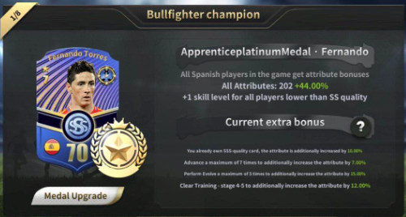
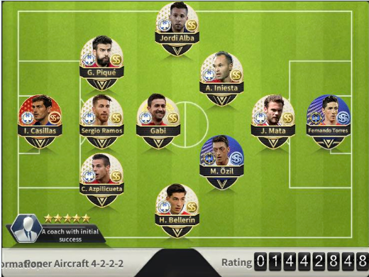
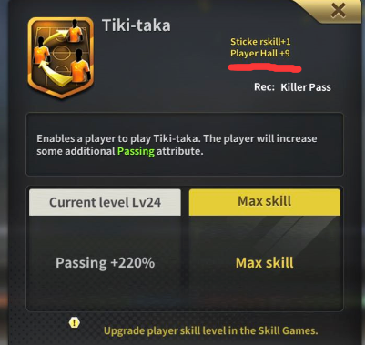

Since 'The Player Hall' feature updated. This game realy change a lot, Player Hall can add a lot attribute for same country player. In the past you can use multinational coalition, but now they force us use one national players.   Because enhance a single country Player Hall is already very difficulty. We don't have enough resource to support multinational.

My torres's Hall is lv.18 , ss skill + 1. lv.18 Hall is a basic line for ss card , I call it Hall +1.

how many resource did I cost for torres? 

It cost me about 676M money, 13.6K yellow blocks,180 green stone and 7900 gems. A country Hall have 8 players, Spanish Hall +8. Total need 5B money, 108.8K yellow blocks,1440 green stone and 63.2K gems.

That's why I suggest use one national players. Most of us can't afford the huge resource for multinational.

let me show you a case who use single spanish country player hall. Of cause ,there is free sss card ogzil.

His player card are most ss quality , but look at his ranking. emmmm... He put all his resource on spanish hall. Spanish Hall + 9,
look at his skill.

Finally, building your team with should follow those principles :
1. Using single country hall(which you like), and also  you can use  few foreign player. But it should be sss card and easy to get, like sss ogzil and sss messi.
2. Chosing player should picking who have a lot sticker. especially for foreign players, like sss messi for spanish hall is a good choice.
3. Find your own attack way. I prefer 'kill pass with fox in box' and 'lofted pass with volley' , I think it's more effective in the beginnig stage(ranking lower than 2M). It's ok for 'breakthrough with diving or composure' or 'poacher with long shot(sss rooney)'. Find your own way.  

Any question can disguess in github's issue.

