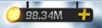

In the [Basic Build Team Suggestion](https://github.com/ZeroIme/cmm-red-suns/blob/master/Basic%20Build%20Team%20Suggestion.MD) I mainly explan how important Player Hall is.

In this essay. I will talk about how to collect those resource.

1. Game Money 

    Use scout to get player card, and sell the useless card. I seems have no good idea to collect it. Sell the useless card seems the fast way. But I never sell A card unless I evolve it once. A card will help finish letter event(get s card, and sell it).

2. Yellow blocks 

    As we all know it only produce in World Tournament. It it obvious that use gems to negotiation, so we have only 10 times to negotiation. I suggest to negotiate to 'Finbury Pub'. It is easy to negotiation for twince.  But 'Finbury Pub' won't give you green stones.

3. Green Stones 

    Green Stones is hard to get it. It only produce upper 'Finbury Pub'. And it is very easy to be robbed. there is a bad way to get it. But I think it is the most economical way. You need prepare 2 ~ 5 account which is over lv.40(min level for World Tournament),  you can guard your small account to get green stone. And also you can rob others. It is a bad way to get green stone, but effective.

4. Gems 

    Gems, emmmmmmmmm........... top up or not it is a choice. monthly card seems is a good top up options. But if you can't get more, please save it. There are many place thirst for gems.
   